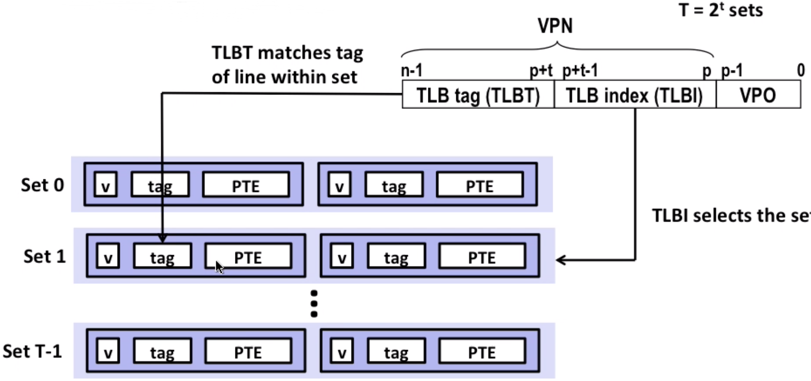

# Class Notes

[TOC]

## 1. Overview

### Course theme

- theme：Abstraction is good but don't forget reality

### Five realities

- **ints are not integers；floats are not real**
  - To understand numbers in computer
  - eg：`x^2 >= 0`?
    - for float：yes！
    - for int： `40000*40000=1600000000` yes! `50000*50000=??` not!
  - eg：`(x+y) + z = x+(y+z)`?
    - for int: yes!
  - for于 float: `(1e20+-1e20)+3.14 = 3.14`； `(1e20+(-1e20+3.14) = ??`
- **you've got to know assembly**
  - learning about assembly
- **memory matters**
  - memory management
  - eg：
- **there's more to performance than asymptotic complexity**
  - eg：
- **computers do more than execute programs**
  - IO/network

### How the course fits into the CS/ECE curriculum

build up the base for another courses.

### Course architecture

- programs and data
  - L1(datalab): manipulating bits
  - L2(bomblab): defuse a binary bomb
  - L3(attacklab): injection attacks

- memory hierarchy
  - L4(cachlab): build a cache simulator

- Exceptional control flow
  - L5(tshlab): write a shell

- Virtual memory
  - L6(malloclab): write a malloc package

- networking and concurrency
  - L7(proxylab): write a web proxy

## 2. Bits,Bytes, and Integers

### Representing information as bits

- Everything is bits.
- Encoding Byte values.

### Bit-level manipulations

- Boolean Algebra
- Bit-level options in C: & | ~ ^
- Logic Operations in C: && || !
- Shift operations
  - eg: 

### Integers

#### Unsigned and signed

- Numeric ranges
  - signed: Tmax, Tmin
  - unsigned: Umax, Umin

#### Conversion, casting

- B2T, T2B
- B2U, U2B
- U2T, T2U
- Note: if both signed and unsigned in one expression, **signed value implicitly cast to unsigned**.
  - eg: `for(int i = n; i-sizeof(char); i--) {}  // run forever!`
- Corner case: normally -(-x) = x, but **-Tmin(-32) != Tmax(31)** (number is in 5 bits)

#### Expanding, truncating

- expanding
  - eg: 1010(-6) -> 111010(-6)
- truncating
  - eg: unsigned: `11011(27) -> 1011(9)  // mod 16`
  - just remember: directly get the bytes then calculate it.

#### Addition, negation, multiplication, shifting

- addition(negation)
  - unsigned addition
  - complement addition
  - overflow
- multiplication
  - unsigned multiplication
  - signed multiplication
    - eg: 5 * 5 = 25:0001-1001(-7). the result is -7
- shift
  - power-of-2 multiply with shift
  - unsigned power-of-2 division with shift
    - eg: 0011(3) /2 (>>1) = 0001(1)--logical shift
  - signed power-of-2 division:
    - eg: 1101(-3) /2 (>>1) = 1110(-2)--arithmetic shift

- extra:
  - x -> -x, just do !x+1
    - eg: -(1010) (-6) = 0101+0001 = 0110(6)

### Representations in memory, pointers and strings

- Byte-Oriented Memory Organization
- Machine words: 32bits, 64bits
- Word-Oriented Memory Organization
- Byte Ordering
  

## 3. Floating Point

### Fractional binary number

eg:

- 5 + 3/4 = 101.11~2~
- 2 + 7/8 = 10.111~2~
- 1/3 = 0.0101[01]...~2~

### IEEE Floating Point


- **f = (-1)^s^  M  2^E^**
  - `E = exp - Bias`
    - eg. exp has 8 bits, **Normally** 1<=exp<=254, bias = 127, so `-126<=E<=127`
    - why introducing the `bias`? for better comparison
  - M = 1.0 + frac = 1.xxxx..x~2~
    - eg. minimum: xxxx..x = 0000..0, M = 1.0
    - eh. maximum: xxxx..x = 1111..1, M -> 2.0
  - Take 15123 as an example:
    - 15213 = 11101101101101~2~ = 1.1101101101101~2~ * 2^13^
    - M = 1.1101101101101~2~, frac = `1101101101101` + `0000000000`
    - E = 13, bias = 127 -> exp = 140 = 10001100~2~
    - so result:
      - 0
      - 10001100
      - 1101101101101 0000000000
      - totally 32 bits

- For **Denormalized Number**: when exp = 00000..0
  - **E = 1 - bias**,
  - **M = frac** (no leading 1)
  - cases:
    - frac = 0000.0: representing `0` (including `-0` and `+0`)
    - frac != 0000.0: closest to `0`

- For **Denormalized Number**: when exp = 1111..1
  - **E = 1 - bias**,
  - **M = frac** (no leading 1)
    - why for this? to represent more numbers, see the figure below
  - cases:
    - frac = 0000.0: representing `inf`
    - frac != 0000.0: representing `nan`

- Examples together


- Note: when closing to 0, the numbers get denser

### Rounding, addition and multiplication

#### Round

- strategy
  - Towards 0
  - Round down(-inf)
  - Round up(+inf)
  - Nearest Even(**default**)

- eg: round to nearest 1/4
  - 2 + 3/16 = 10.00`110`~2~ = 10.01~2~ (>1/2 - UP)
  - 2 + 7/8 = 10.11`100`~2~ = 11.00~2~ (exactly half)
  - 2 + 5/8 = 10.10`100`~2~ = 10.10~2~ (exactly half)

#### multiplication

- (-1)^s1^  M1  2^E1^ * (-1)^s2^  M2  2^E2^
  - s = s1 ^ s2
  - M = M1 * M2
  - E = E1 + E2

- if after calculation,
  - M > 2 -> shift M right, **increment E**
  - If E out of range, **overflow**
  - Round M to fit **frac**

So now you understand why `(1e20*1e20)*1e-20 = inf`； `(1e20*(1e-20*1e20) = 1e20`

`a>=b & c>=0 so a*c >= b*c`? Almost, Always consider **inf** and **nan**

#### addition

core: **get binary points lined up**

- (-1)^s1^  M1  2^E1^ + (-1)^s2^  M2  2^E2^

- if after calculation,
  - M > 2 -> shift M right, **increment E**
  - M < 1 -> shift M left, **decrement E**
  - If E out of range, **overflow**
  - Round M to fit **frac**

So now you understand why `(1e20+-1e20)+3.14 = 3.14`； `(1e20+(-1e20+3.14) = ??`

### Floating point to C

int -> float: round 32 bits value to 23 bits frac

double -> int: round 52 bits frac to 32 bits

2/3 != 2/3.0 (floating point)

double d < 0 -> d*2 <0 (YES! even if overflow, it's `negative inf`)

## 4. Machine Level Programing

### C, assembly, machine code

The process of compiling C:


Compiler: GCC, to make assembly code: `gcc -Og -S ...`

to make exec file(actually bytes of instructions) into assembly code: `objdump -d ...`

### Assembly Basics: Registers, operands, move

Some specific registers:

- `%rsp`: stack pointer
- `%rdi`: first argument of function
- `%rsi`: second argument of function
- `%rdx`: third argument of function

the relationships between different names of a register:

```bash
|63..32|31..16|15-8|7-0|
              | AH |AL |
              | AX.....|
       |EAX............|
|RAX...................|
```

Memory access of **moveq**:

- Normally: `(%rax)` = `Mem[rax]`
- With offset: `8(%rax)` = `Mem[rax + 8]`
- Generally: `D(Rb, Ri, S)` = `Mem[Rb + S * Ri + D]`

### Arithmetic & logical operations

For example: **leaq**

- `leaq 4(%rsi, %rsi, 2), %rdx`: `rdx = rsi + 2 * rsi + 4`

### Control: Condition codes

- `%rip`: instruction pointer
- **Condition Codes**
  - `CF`(carry flag)--for `unsigned` overflow
  - `ZF`(zero flag)
  - `SF`(sign flag)--for `signed`
  - `OF`(overflow flag)-- for `signed` overflow

- `cmpq`: compare number (`b-a`) and set condition codes above
- `testq`: compare number (`a&b`) but only set `ZF` and `SF`
- `setX`: set the low-order byte of destination to `0` or `1` based on the condition codes above


- example

```c
int gt (long x, long y) {return x>y;}
```

```assembly
# compare x, y  (%rsi is y, %rdi is x)
cmpq    %rsi, %rdi

# Set when > (if x-y > 0, SF=1 and OF=1 or SF=0, OF=0)
setg    %al

# move bytes to long, zero padding
# Note this is %eax rather than %rax
# this is because 32-bit instructions also set upper 32 bits to 0.
movzbl  %al,  %eax
ret
```

### Conditional branches

- `jX`: jump to different part of code depending on condition codes


- Note: Sometimes like `Test? x+y:x-y` in C, it's efficient to calculate `x+y` and `x-y` both, then choose one using `conditional move` rather than using branches. Since **branches are very disruptive to instruction flow through pipelines**

- `conditional move`
  - eg: `cmovle %rdx %rax`: if <=, result = %rdx
  - only use this when calculation is simple and is safe!

### Loops

Using branches and control introduced above to realize `do-while`, `while` and `for`.

### Switch Statements

- Structure:


- How to form a jump table?


Normally to make an array, and for some holes like `x=0`, `x=4`, let it go to the default part.

Note: if x has a extremely large case like 10086, it can add a **bias** then make an array flow(like mapping to 7), too. Or sometimes it can be optimized to a decision tree--simple **if else** structure(in cases it's hard to make an array flow)

- How to jump through table?

```assembly
# x compare 6
cmpq $6, %rdi

# Use default: since we use **ja**(unsigned) here
# jump if x > 6 or x < 0(unsigned negative is a large positive)
ja   .L8

# refer to (L4 + 8 * %rdi) address, get the value of it and then jump
jmp *.L4(, %rdi, 8)
```

### Stack Structure


### Calling Conventions

- passing control: when calling a function, push the next instruction address to the stack, when ret, get the address back then jump to the address.


- passing data:


- save local data:


Normally, use `%rsp` directly, sub some value at the beginning, then add it back before `return`.


It's OK to use `movl` to `%esi`, since the rest of 32 bits would be set to zero. This depends on the compiler

Sometimes use `%rbp`, like allocating an array or memory buffer

- **Caller Saved** and **Callee Saved**

Rules we need to obey, set in ABI(application binary interface)

caller saved: the register can be overwritten--`%rax`, all of the arguments from `%rdi` to `%r9`, tmp `%r10` and `%r11`

callee saved: the callee make sure not to affect any data used in the caller--`%rbx`, from `%r12` to `%r14`, `%rbp` and `%rsp`

- recursive function example:


### Arrays


### Structures


### Floating Point

float add(param passed in `%xmm0`, `%xmm1`):


double add:


### Memory Layout


- **stack** for local variable (if more than 8MB, segmentation fault)
- **heap** memory is dynamically allocated for `malloc`、`new` ...
- **data** is for `static` data
- **Text/Shared** Libraries for executable instructions(read only)

### Buffer Overflow


If you input 23 characters in `gets()`, it's ok (a default `\0` at the end of line)

If you put 24 characters or more, it will gets to the `return address` and may cause a `segmentation fault`(depends on the address you jump to)

#### code injection attacks

Covering the return address, and use the instruction we input (see `attacklab` for more details)

Ways to avoid:

- avoid overflow Vulnerabilities in Code:
  - `fgets` instead of `gets`
  - `strncpy` instead of `strcpy`
  - don't use `scanf` with `%s`
- system-level protections
  - random stack offset: hard to predict the beginning of code
  - non-executable code segments: only execute the `read-only` memory instructions
- stack Canaries
  - save `Canary` in %rsp at first and then recheck it in the end(see `bomblab` for more details)

#### Return-Oriented Programming attacks


Use existing codes(gadgets) to attack, see **attacklab** for more details.

## 5. Program Optimization

### Generally Useful Optimizations

- Code motion/pre-computation


- strength reduction

Core: replace costly operation with simpler one (eg. 16 * x -> x <<4)

- sharing of common sub-expressions

eg: `f = func(param)`, then use f directly, instead of `a = func(param) + 2, b = func(param)*3 ...`

- removing unnecessary procedure calls


Why compiler doesn't optimize this? Remember compiler always considers the procedure as **black box**. (It doesn't know whether the procedure will change the pointer or global variable, etc.)

Note: in **python**, `len(str)` is a O(1) func, so it doesn't really matter.

- Remove memory accessing


As you can see the `b[i]` has to read from memory **each time**

It's better using a local variable to cal the sum

Why compiler can't optimize it? **Memory Aliasing**


### Exploiting instruction-level parallelism

- CPE (cycles per element (OP like `add`) )

- modern cpu design


- ideas of pipeline


(`p1 = a*b`, dependency)

- Loop Unrolling

For making use of multi-core processor

```c
for (i = 0; i < limit; i += 2){
  // x = x + array[i] + array[i+1];
  x = x + (array[i] + array[i+1]);  // can break the sequential dependency
  
  // another idea
  // x0 = x0 + array[i];
  // x1 = x1 + array[i+1];
}
```

Note: Not always useful, based on the processor

- SIMD operations

Based on wide registers:


Also called **AVX instructions**

### Dealing with Conditionals

In order to making instructions run smoothly. We introduce the **branch predict**


- Simply **guess** the branch to go
- Begin executing instructions at predicted position


- It can recover when mis-prediction, causing huge performance cost

### C Review

- Be careful when `unsigned u > -1`: `-1` is the biggest when unsigned
- Initialize array with exact value
- Remember there is a `\0` at the end of string
- When `sizeof(xx)`, make sure xx is not a pointer
- Remember to `free` after `malloc`
- Don't return a pointer pointing at a local variable
- `int *a;` when `a + 1`, address of a actually add `sizeof(int) * 1 = 4`

## 6. Memory

### Storage technologies and trends

- Random-Access Memory(RAM)
  - SRAM(static, expensive, cache, volatile: lose information when power off)
  - DRAM(dynamic, main memory, volatile)

- Read-only memory(ROM)
  - nonvolatile: keep information when power off
  - BIOS, firmware programs saved in ROM

- Bus(collection of parallel wires) structure


- Disk


capacity: `512 bytes/sector * 300 sectors/track(on average) * 20000 tracks/surface * 2 surfaces/platter * 5 platters/ disk = 30.72GB`

disk access:


Normally `disk access time = seek time(4~9ms) + rotation(2~5ms) + transfer(0.02ms)`, much slower than RAM(`ns`)

- Bus structure expand


Note: this is not the modern design, which use point to point connection instead of a public wire

- **interrupt**: cpu never waits for disk, when data is carried from disk to memory, it will notify cpu and let cpu continue to work on that data.

- solid state disk(ssd): much faster than normal disk


- cpu-memory-gap


### Locality of reference

- **principle** programs tend to use data and instructions with addresses near or equal to those they have used recently

### Caching in memory hierarchy


### Cache memory organization and operation

- general cache organization


`cache_size = S * E * B bytes`

- cache read


1. locate **set**
2. check all lines in set to match **tag**
3. **tag** matches and **valid** is true: **hit**
4. locate data by **offset**

Note: if not match, old line is **evicted and replaced**

- simple example


When there comes a `8 [1000]`, it will miss, and set 0 is evicted


And when there comes a `0 [0000]`, it will miss again


However, if we change the bits of lines(2-way associative), it will change.

- block size: hyperparameter of memory system
  - if too small: locality principle(easily use nearby bytes) is not used
  - if too large: long time to evict memory

- cache write
  - write-hit
    - `write-through`: write data in cache immediately to memory
    - `write-back`: defer write until replacement of line(need a dirty bit in cache)
  - write-miss
    - `write-allocate`: load into cache first(good if more writes to the location follow. **Note**: a block in cache is large)
    - `no-write-allocate`: write straight to memory
  - a good model: `write-back` + `write-allocate`

- intel core i7 cache hierarchy:


  
### Performance impact of caches

- metrics
  - `miss rate`: `misses / accesses`
  - `hit time`: how much time used when hit(eg: 4 clock cycles for L1)
  - `miss penalty`: how much time used when miss(eg: 50~200 cycles to fetch from memory)

- memory mountain:


When stride increases(`for (int i = 0; i < limit; i += stride)`), **spatial locality** decreases (you are not accessing the data nearby).

When size increases (array to visit is too large), **temporal locality** decreases (cache can't hold too much data).

- example: matrix multiplication(considering `block_size = 32Bytes`, data type is `double` so normally it will miss every four iter)

This is a normal pattern(2 loads, 0 stores):


This is another pattern(2 loads, 1 stores):


Although 1 stores in pattern 2, it doesn't matter(because of **write-back**, it's more flexible, you don't have to wait)

- block matrix multiplication: use block to speed up

**Warning**: maybe useful in efficiency(a little bit), quite useless in real project(non-readable code for your teammates)


A specific example:


We should handle 5&6 next to make use of the cache (`A[1][0]` miss, `A[1][1]` hit, `B[0][1]` hit, `B[1][1]` hit)

## 7. Linking

### static linking


- **cpp**: c pre processor
- **cc1**: compiler
- **as**: assembler as
- Note: separate compile and then put it together
  - Modularity: well organized
  - Efficiency: just need to compile just some of the content

### Three kinds of object files

- relocate object file(`.o` file)
  - each `.o` is exactly from one `.c` file
- executable object file(`.out` file)
- shared object file(`.so` file)
  - can be loaded into memory and linked dynamically, at either load time or run-time
  - called **Dynamic Link Libraries**(DLL) by windows

### ELF(Executable and Linkable Format)


- elf header: word size, byte ordering, file type(`.o`, `.so` etc)
- segment header table: page size, virtual address, memory sections, segment sizes.
- `.text`: the code
- `.rodata`: read only data(jump tables...)
- `.data`: initialized global data
- `.bss`: uninitialized global data, "better saved space", occupies no space
- `.symtab`: symbol table
- `.rel .text`: relocation info for `.text`, instructions for modifying
- `.rel .data`: relocation info for `.data`
- `.debug`: info for symbolic debugging(`gcc -g`)
- Section header table: offsets and sizes of each section

Note: `local static variable` is stored in `.bss` or `.data`

### Linker Symbols

- global symbols
  - can be referenced by other modules, `non-static` functions or `non-static` global variables
- external symbols
  - global symbols that are referenced by a module but defined by some other modules
- local symbols
  - defined and referenced by a module itself
  - **static** C functions and **static** global variables
  - **not local program variables(on the stack)**

### What do linkers do?

- step1: Symbol solution
  - symbol definitions are stored in object file(by assembler) in `symbol table`(array of struct, including name, size and its location)
  - linker make sure each symbol has exactly one definition

- step2: Relocation
  - merge separate code and data sections into single sections
  - relocate symbols to absolute memory locations
  - update references to these symbols

- Example step1


- Example step2


Relocation entries: compiler doesn't know the location of global variable or functions, so it leaves an entry (**offset** actually) for linker to use


After relocation:


Notice that variable is placed by **absolute address** and function is placed by `PC-relative addressing`

### Linking puzzle

strong and weak symbols to solve duplicate symbol


Three principles of compiler:

- Choose strong symbol
- multiple strong symbols are not allowed.
- If there are only multiple weak symbols, pick an arbitrary one. (`-fno-common` to solve arbitrary pick and avoid some errors)

Some linking puzzles:


Explanation of case 2 and 3: the compiler thinks it is `double` in separate compilation, but it may be `int` in memory location.

So we should avoid global variables if we can.

Otherwise:

- use `static` (make it local symbol)
- initialize the global variable
- use `extern` if you refer an external global variable

### Linking in Memory


**brk**: shows the size of **heap**, when using `malloc`, you are adjusting `brk`

### Packing commonly used functions (Library)

#### Static Library

**static libraries**(`.a` archive files) -- old-fashioned solution


- Concatenate related relocatable object files (.o files) into a single file(an `archive`)
- Allows incremental updates
- Example: `libc.a`(C standard library) -- 4.6MB archive of 1496 object files
- When used, can just choose to pick one `.o` from an archive, eg.: `printf.o` from `libc.a`

- Linker's algorithm for scanning

1. scan `.o` and `.a` files in the **command line order**, keeps a `unresolved references list`
2. as each new `.o` or `.a` file is encountered, try to resolve each unresolved reference in the `unresolved references list`
3. error if any entries in the unresolved list at the end of scan.
4. So, the command line order matters


Here `libtest.o` calls a function defined in `-lmine`, it's ok in the first order, but it can't find it in the reverse order.

#### Shared Library

**shared libraries** (`.so` file) -- modern solution

- dynamic linking at **load-time**:


- dynamic linking at **run-time** by `dlopen`, `dlsym` etc

### Library interpositioning

Allow programmers to **intercept** calls to arbitrary functions, so we can print more information of func calls like `malloc` or do something extra.

- interpositioning in **compile** stage

```c
void *mymalloc(size_t size)
{
  void *ptr = malloc(size);   // call the real malloc
  printf("malloc(%d) = %p\n", (int)size, ptr);
  return ptr;
}

// our own malloc.h
#define malloc(size)  mymalloc(size)
#define free(ptr)     myfree(ptr)
```

then `gcc -I. -o myprog myprog.c mymalloc.c`, `-I.` means find header file first in current work directory

- interpositioning in **linking** stage

```c
void *__real_malloc(size_t size);

// wrap function
void *__wrap_malloc(size_t size)
{
  void *ptr = *__real_malloc(size);    // call for real malloc function
  printf("malloc(%d) = %p\n", (int)size, ptr);
  return ptr;
}
```

then `gcc -Wl,--wrap,malloc -Wl,--wrap,free -o intl int.o mymalloc.o`

`-Wl,--wrap,malloc` tells compiler that when programmer uses `malloc`, it calls for `__wrap_malloc`, and the `__real_malloc` calls for `malloc` provided by standard library.

- interpositioning in **runtime**

```c
/* malloc wrapper function */
void *malloc(size_t size)
{
    void *(*mallocp)(size_t size);
    char *error;

    mallocp = dlsym(RTLD_NEXT, "malloc"); /* Get address of libc malloc */ 
    if ((error = dlerror()) != NULL) { 
        fputs(error, stderr);
        exit(1);
    }
    char *ptr = mallocp(size); /* Call libc malloc */
    printf("malloc(%d) = %p\n", (int)size, ptr);
    return ptr;
}
```

when runs the program, use `LD_PRELOAD="./mymalloc.so" ./intr`

**LD_PRELOAD** environment variable tells the dynamic linker to resolve unresolved refs by looking in `mymalloc.so` first

## 8. Exceptional Control Flow

### 8.1 Control Flow

- **program state**
  - jumps and branches
  - calls and return

- **system state**: exceptional control flow(ECF)
  - exceptions (low level)
  - process context switch: OS software + hardware timer
  - signals: OS software
  - non-local jumps: C runtime library

### 8.2 Exceptions

- An exception is a transfer of control to OS kernel in response to some event(eg: `control-c`)


- There is an exception table and corresponding handler


- Asynchronous exceptions(Interrupts): eg--Timer interrupt
- Synchronous exceptions: caused by an instruction
  - trap: intentional, eg -- **system calls**(like read, open, fork, kill etc)
  - fault: unintentional, eg -- page fault(recoverable), protection fault(unrecoverable)
  - abort: unintentional and unrecoverable, eg -- illegal instruction

- example of fault


here the OS sends **SIGSEGV** signal to user process, and process exits with `segment fault`

### 8.3 Processes

#### Introduction

- A process is an instance of running program
- two key abstractions
  - **logical control flow**: program seems to have exclusive use of CPU, provided by kernel mechanism called `context switching`(saved register and switch to another process). Note: **physical control flow** is the level of instructions.
  - **private address space**: program seems to have exclusive use of main memory, provided by kernel mechanism called `virtual memory`

- concurrent process(one single core)


**concurrent**: flows overlap in time -- A & B, A & C

**sequential**: otherwise -- B & C

- context switch


#### Process Control

- `pid = fork();` to create a child process (Note: always check the pid)
- Child is almost identical to parent:
  - Child get an identical (but separate) copy of parent's virtual address space
  - identical copies of parent's open file descriptors
  - **different** PID

- fork example


Note that `fork()` calls once, but return twice (one in parent, one in child)


- reap child process
  - When process terminates, it still consumes system resources (`zombie process`)
  - parent terminate child (`wait`/`waitpid`) and kernel delete zombie process
  - if parent does nothing, **init process(pid=1)** will reap the child.

- `execve`: loading and running programs
  - different from `process`, it has different codes to run

### 8.4 Shells

linux process hierarchy


**login shell**: user interface, eg: `ls`

A **shell** is an application program (a process) that runs user programs

Note that `waitpid` is used when using **background job**

If no signals, the background job will become **zombies**

### 8.5 Signals

#### Basic introduction

A **signal** is a message that notifies a process that an event has occurred


**Sending signals**: **kernel** sends/delivers a signal to a destination process

**Receiving signals**: destination process **receives** a signal when it is forced by the kernel to react to the delivery of the signal. Some possible ways to react:

- **ignore**
- **terminate**(optional `core dump`--save the memory state or something to a file for debugging)
- **catch** and do something by **signal handler** (then to an asynchronous interrupt)

**Pending signal**: a signal is **pending** if sent but not yet received. **at most one pending signal** since signals are not queued

**Block signal**: a process can **block** the receipt of certain signals

**Process group**:


example of process group: `bin/kill`


example of `ctrl-c`(**SIGINT**) and `ctrl-z`(suspend a process by sending **SIGTSTP**, putting the process into **background** and **stop running**):


**STAT**:

- first letter: `S`: sleeping, `T`: stopped, `R`: running, `Z`: zombie
- second letter: `s`: session leader, `+`: foreground process group

**signal handling example**:


signal handler as concurrent flow:


and handler can be interrupted by other handlers(nested handlers):


The ways to temporarily block signal: `Sigprocmask`


#### Write safe handlers

**async-signal-safe**: reentrant(eg: all variables stored on stack) or non-interruptible by signals.

- keep your handlers as simple as possible (eg: set flag and return)
- call only async-signal-safe functions in your handler(`printf`, `malloc`, `exit` are not safe!)
- save and restore `errno` on entry and exit (so other handlers don't overwrite)
- protect access to shared data structure(so avoid concurrent issue)
- declare global variables as **volatile**(to prevent compiler from storing them in register, only in memory)
- declare global flag as `volatile sig_atomic_t`(`sig_atomic_t` is a safe type)

why is `printf` unsafe? It has a lock, if one thread requires a lock, and before release it, it's interrupted and the handler wants to `printf` again --- dead lock.

you can't use signals to count events, since pending signals **are not queued** (at most one pending signal of any type)

`pause()` can be dangerous: `parent` sets `pid=0`, if `pid` is `0` and the signal comes between while and `pause()`, the `pause()` may wait forever.


so here we can use `Sigsuspend`

### Nonlocal jumps

jump(return) from one function directly to another function without calling it by using `setjmp`, `longjmp`.

## 9. System-Level I/O

### 9.1 Unix I/O

- regular file
  - text files: ASCII or Unicode
  - Binary files: .jpg image or object files... everything else

- directories
  - consists of an array of links
  - tree hierarchy

- Note: Do not call system call (`read`, `write`) too many times because of the cost of context switch unless you have to. Try read more bytes at one time

### 9.2 RIO(robust I/O) package

A robust wrapper for basic I/O.

### 9.3 Metadata, sharing and redirection

Metadata: maintained by kernel, accessed by `stat` and `fstat`

How unix kernel represents open files:


So file sharing makes sense:


Note: `fork`, a child inherits its parent's open files


Remember to call `close()` both in parent and child codes.

I/O redirection by using `dup2`:


### 9.4 Standard I/O

`fopen`, `fead`, `fflush` etc.

Note: there is a buffer in standard IO to reduce multiple system calls


### 9.5 Closing remarks

\

- standard IO is not suitable for network sockets(not designed for it)
- standard IO functions are not **async-signal-safe** (unix IO functions are), and not appropriate for signal handlers
- standard IO can help you decrease the number of system calls and handle short counts(`a = read() < 0`)

## 10. Virtual Memory


MMU: Memory Management Unit, does address translation

VM can help:

- use main memory efficiently(cache)
- simplify memory management
- isolate address space(to protect privileged kernel and code)

### 10.1 VM as a tool for caching


**Virtual memory** is an array of N contiguous bytes, the content of the array on disk are cached in **physical memory(DRAM Cache)**


**Page table** is an array of PTEs(page table entries) that maps virtual pages to physical pages.


**page miss** causes page fault(an exception), page fault handler selects a victim to be evicted(here VP4), then put VP3 to the place of VP4


Here we allocate a new page(VP5).

The virtual memory here seems inefficient, but it works because of locality. If `**working set(the active pages program tend to access)** < main memory size`, good performance. Otherwise, since we need to swap pages, performance are down.

### 10.2 VM as a tool for memory management


Key idea: **each process has its own virtual address space**

they can also share code and data(read-only)


It can also simplify linking and loading:

- each program has similar virtual address space. Code, data and heap always start at the same address.

### 10.3 VM as a tool for memory protection


Extend PTEs with permission bits, MMU checks these bits on each access.

### 10.4 Address translation


Just like a fully-associated cache system. Started by a virtual memory address, and finally get the physical memory address.

Note that offsets are the same.


The process of page hit. Note for `2~3`: MMU fetches PTE from page table in memory


The process of page fault. Note for `7`: Handler returns to original process, restarting faulting instruction.

### 10.5 Speeding up Translation by TLB

#### Basic concepts

Translation Lookaside buffer(TLB): a small set-associative hardware cache in MMU, contains complete page table entries for small number of pages.



TLB-hit:


TLB-miss:


#### Example for TLB

1MB of virtual memory, 4KB page size, 256KB of physical memory, TLB: 8 entries, 2-way set associative

- How many bits are needed to represent virtual address space? 20 (`2^20 = 1MB`)
- How many bits are needed to represent physical address space? 18
- How many bits are needed to represent offset?   12 (`2^12 = 4KB`)
- How many bits are needed to represent VPN(virtual page number)?  8
- How many bits are in the TLB index?  2 (since we have four sets totally)
- How many bits are in the TLB Tag?    6 (just the rest)

Another example:


### 10.6 Multi-Level Page Table

One-Level page table can take up a lot of space.

Eg: 32 bit-environment, 4 KB(2^12) page size, we should have `2^32 * 2^-12 = 2^20` pages, 4-byte PTE, totally `2^22 bytes = 4MB` for one process. 1000 process = 4GB

Eg2: 64 bit-environment, 4KB page size, 48-bit address space(24 bits reserved), we should have `2^36` pages, 8-byte PTE, totally `2^39 bytes = 512GB` page table!

Note: page size means dividing physical memory into several blocks, the size of block is page size. PTE is for offset in a page(and some privileged bits).


The way to translate multi-level-page-table:


### 10.7 Intel Core i7 Memory System


### 10.8 Memory Mapping


Mapping memory to file.


Private Copy-on-write(COW) objects.

And Note that this is why `fork` can be efficient. It doesn't really copy data that can be shared by two processes.


The process of **execve**(load and run a new program in the current process):

- free `vm_area` and page table for old areas
- create `vm_area` and page table for new areas
- set PC to entry point in `.text`

Using memory mapping a lot here.

**mmap**: allows you to do memory mapping like kernel does.

## 11. Dynamic Memory Allocation

### 11.1 Basic concepts


Require virtual memory by using ways such as `malloc`(to Heap, maintained by **blocks**).

Allocators:

- explicit allocator: C `malloc` and `free`
- implicit allocator: java allocates memory but do not need free (garbage collection)

Note: in this lecture, the unit of malloc is `word`（4 bytes）

Example:


Fragmentation:

- **Internal fragmentation**: Blocks have to be aligned, when payload is smaller than one single block, this happens.
- **External fragmentation**: As the picture shows above, the fragmentation appears.

Q: How much to free? (since we only have a pointer passed to the `free` function?)


A: by using a header

### 11.2 Implicit list

Q: How to keep track of free blocks?

A: Implicit list to links all of (headers of) the blocks. **Additional bit for allocation status**. Trick: if blocks are aligned, some low-order bits are always zero(4 bytes, 1000...)


example:


final block(size 0 / status 1) to be the end of search.

Q: ways to use implicit list?(**placement policy**)

A:

- **first fit**: scan from the beginning
- **next fit**: scan starts from the last malloc(fast but maybe more fragments)
- **best fit**: search all of the list and find the best malloc to reduce fragments

Q: How to free by using implicit list?

A: Coalescing


But in this way we couldn't coalesce the block we used before.

So we can use **boundary tags**(constant free even with coalescing):


Note: **boundary tags** can be also optimized. For example, we can add additional status bit to represent whether the previous block needs to coalesce.

**Coalescing policy**:

- immediate coalescing: coalesce each time `free` is called
- deferred coalescing: coalesce as you scan the list for `malloc` or external fragmentation reaches some threshold.

### 11.3 Explicit free lists


Maintain list of **free** blocks. That's why we can use payload area.


Note that blocks can be in any order.


It's easy to allocate now.

For free, tow policies:

- LIFO(last-in-first-out)
  - insert freed block at the beginning of the list
  - simple and constant time, more fragmentation

- Address-ordered policy
  - make sure `addr(prev) < addr(curr) < addr(next)`
  - requires search but less fragmentation.

LIFO eg:


LIFO eg2: with coalesce(remember to use boundary tag)


LIFO eg3: with coalesce


Explicit list only care for **free blocks** instead of **all blocks**, much faster when memory is nearly full.

### 11.4 Segregated free lists

Each **size class** of blocks has its own free list.


separate classes for small size; two-power size class for larger sizes.

- Higher throughput(log time for power-of-two size classes)
- Better memory utilization: approximates a best-fit search.

### 11.5 Garbage collection

Automatic garbage collection: application never has to free.

Classical GC algorithms

- Mark-and-sweep collection: introduce later
- Reference-counting: reference count to indicate whether an object can be freed.
- Copying collection: copy all of used object in A to B, then free A. Not used too much
- Generational Collectors: based on lifetimes

Mark-and-sweep:


**root**: Locations not in the heap and contain pointers into the heap(e.g. registers, global variables)
**reachable**: a path from root to node.
**garbage**: non-reachable node.

When out of space:

1. **Mark**: start at roots and set **mark**(extra mark bit) on reachable node recursively.
2. **Sweep**: scan all blocks and free blocks that are not marked


Note: mark-and-sweep in C is conservative, you don't know a large number is **a pointer or a long type**. So we can use a balanced tree to keep track of all allocated blocks.
